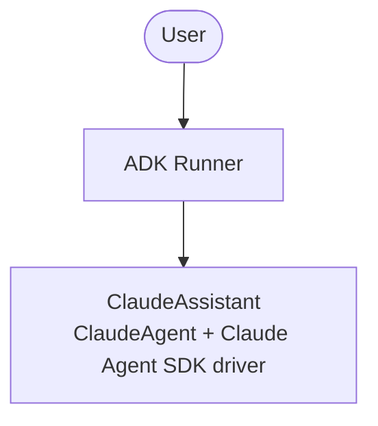

# Basic Agent with Claude (Claude Agent SDK)

A minimal example running [Anthropic](https://anthropic.com/) Claude as an
external ADK agent through the official
[`@anthropic-ai/claude-agent-sdk`](https://www.npmjs.com/package/@anthropic-ai/claude-agent-sdk)
driver. The `ClaudeAgent` is the root ADK agent, wrapped in an ADK `Runner`.

## Architecture



## Setup

1. Copy the environment file. Credentials are optional if the local Claude Code
   CLI is already authenticated on this machine:
   ```bash
   cp .env.example .env
   # Optionally edit .env and add your ANTHROPIC_API_KEY
   ```

2. Install dependencies:
   ```bash
   bun install
   ```

3. Run the smoke script (sends one prompt):
   ```bash
   bun run smoke
   ```

   If no credential and no local Claude Code CLI are available, the script
   prints a setup hint and exits cleanly without crashing.

4. Or run the agent with DevTools:
   ```bash
   bun run web
   ```

## Authentication

The `ClaudeAgent` resolves credentials via the environment or the native Claude
Code CLI auth/OAuth already configured on this machine. Provide one of:

- `ANTHROPIC_API_KEY` (takes precedence over subscription OAuth)
- `ANTHROPIC_AUTH_TOKEN`
- `CLAUDE_CODE_OAUTH_TOKEN`
- A local, authenticated Claude Code CLI

To change the smoke prompt, set `SMOKE_PROMPT` in `.env` or edit `agent.ts`.

## Example Questions

- "In one sentence, what is the Google Agent Development Kit (ADK)?"
- "Explain the difference between an LLM agent and an external agent."
- "What providers does adk-llm-bridge support?"
