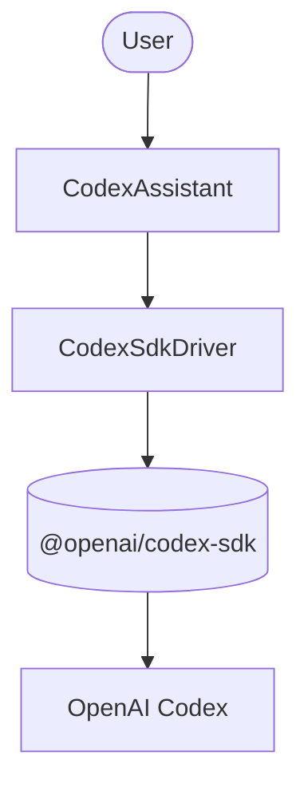

# Basic Agent with OpenAI Codex (external ADK agent)

A single-agent example running [OpenAI Codex](https://developers.openai.com/codex/sdk/)
as an external ADK agent via the bundled Codex SDK driver.

## Architecture



Unlike the LLM-provider examples, `CodexAgent` does not use a `model` from the
bridge. It is an external agent: the `CodexSdkDriver` (the default driver for
`CODEX_AGENT_DEFINITION`) launches Codex through `@openai/codex-sdk` and streams
its events back into the ADK runner.

## Setup

1. Copy the environment file and add your credential:
   ```bash
   cp .env.example .env
   # Edit .env and add OPENAI_API_KEY (or CODEX_API_KEY), or skip this and rely
   # on a local `codex` CLI that already has native Codex auth configured.
   ```

2. Install dependencies:
   ```bash
   bun install
   ```

3. Run the one-prompt smoke script:
   ```bash
   bun run smoke
   ```

   Or explore interactively with DevTools:
   ```bash
   bun run web
   ```

## Credentials

The Codex SDK driver needs ONE of the following at runtime:

- `OPENAI_API_KEY` or `CODEX_API_KEY` set in the environment, or
- a local `codex` CLI binary on your `PATH` with native Codex auth configured.

If none is available, `bun run smoke` prints
`set OPENAI_API_KEY (or local codex CLI) to run this example` and exits 0 without
crashing, so the example always type-checks and builds.

## Example Questions

- "In one sentence, what is OpenAI Codex?" (default smoke prompt)
- "List three things a coding assistant is good at."
- "Explain what an ADK external agent is in two sentences."

To change the smoke prompt without editing `agent.ts`, set `SMOKE_PROMPT`:

```bash
SMOKE_PROMPT="Summarize what this example does." bun run smoke
```

To change the agent's behavior or permissions, edit `agent.ts` and update the
`CodexAgent` config (`instruction`, `permissions`, `workingDirectory`).
