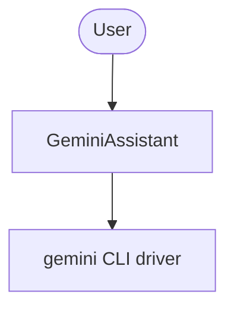

# Basic Agent with Gemini (Gemini CLI)

A single external ADK agent that runs [Google Gemini](https://ai.google.dev/) via
the Gemini CLI driver (`GeminiCliAgent` from `adk-llm-bridge/agents`).

## Architecture



## Setup

1. Copy the environment file and add your Gemini credential:
   ```bash
   cp .env.example .env
   # Edit .env and set GEMINI_API_KEY (or rely on a local, authenticated gemini CLI)
   ```

2. Install dependencies:
   ```bash
   bun install
   ```

3. Run a one-shot smoke prompt:
   ```bash
   bun run smoke
   ```

   Or explore the agent in DevTools:
   ```bash
   bun run web
   ```

## Credentials

The Gemini CLI driver resolves credentials from the environment or a local
`gemini` CLI that is already authenticated on this machine:

- `GEMINI_API_KEY` (preferred) or `GOOGLE_API_KEY`
- a local, authenticated `gemini` CLI (e.g. `gemini auth login`)
- Vertex AI mode via `GOOGLE_GENAI_USE_VERTEXAI`, `GOOGLE_CLOUD_PROJECT`,
  `GOOGLE_CLOUD_LOCATION`, and `GOOGLE_APPLICATION_CREDENTIALS`

If neither a credential nor a local `gemini` CLI is available, `bun run smoke`
prints `set GEMINI_API_KEY (or local gemini CLI) to run this example` and exits
cleanly instead of crashing.

## Example Questions

- "In one sentence, what is the Google ADK?"
- "Summarize the difference between an LLM agent and an external agent."
- "List three things the Gemini CLI driver can do."

To change the smoke prompt, set `SMOKE_PROMPT` in `.env`, or edit the config in
`agent.ts`.
